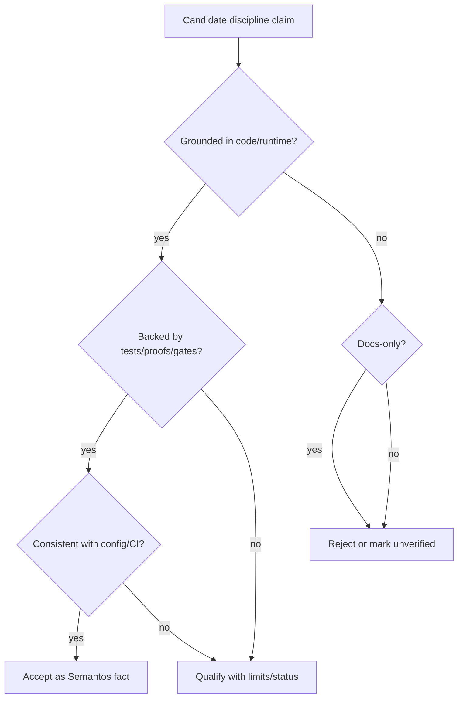

# Semantos Operational Pitfalls and Checklists

Stage: `operational_pitfalls`  
Discipline: `semantos`  
Authority rule: code/proof/test/config/runtime snapshots first; docs/plans only as hints.

## Evidence scope for this artifact

This checklist is grounded in the code-first source corpus and repo snapshot, especially:

- Source corpus/source map: `runs/20260613-120324-code-first/source-map.md`; `sources-code/` snapshot, 4,164 markdown snapshots from `semantos-core` at root revision recorded in the source map.
- Build/runtime entrypoints: root `package.json`; `runtime/node/package.json`; `runtime/node/src/daemon.ts`; `runtime/node/build.zig`; `runtime/shell/package.json`; `core/cell-engine/build.zig`.
- Runtime deployment config: `docker-compose.yml`; `systemd/semantos-node.service`.
- CI/gates: `.github/workflows/gate.yml`; root scripts in `package.json`.
- Formal/proof evidence: `proofs/compliance-matrix.json`; `proofs/lean/Semantos.lean`; `proofs/lean/Semantos/Category.lean`; `proofs/lean/Semantos/Lexicons.lean`; `core/cell-engine/proof-artifacts/proof-4-of-7.json`.
- Tests called out by the code-first source map: `apps/semantos/test/**`, `apps/loom-svelte/tests/**`, `core/semantos-sir/src/__tests__/authority.test.ts`, `core/protocol-types/src/semantic-fs/__tests__/semantic-search.test.ts`, `runtime/session-protocol/src/swarm/__tests__/**`, and cell-engine Zig tests/fuzz jobs referenced by `.github/workflows/gate.yml`.

## Source conflict rules

Future agents should apply this precedence order when claims disagree:

1. **Executable code wins**: implementation files such as `runtime/node/src/daemon.ts`, `runtime/node/build.zig`, `core/cell-engine/build.zig`, package exports, service files, and compose files define what actually runs.
2. **Tests/proofs constrain interpretation**: Lean/TLA/compliance artifacts and test files are evidence of intended invariants only where they are executable/validated by gates. Treat generated proof artifacts with `PENDING` status as incomplete, not proven.
3. **Config and CI define supported workflows**: root `package.json`, workspace package scripts, `.github/workflows/gate.yml`, Docker/systemd files, and build manifests are stronger than README prose.
4. **Docs/plans are secondary hints**: README, PRDs, canon files, design notes, and planning documents may explain vocabulary but must not override code behavior.
5. **Prefer fresh snapshot paths**: use `/home/jake/.edwinpai/disciplines/semantos/state/semantos-core-repo/...` for source truth and `/home/jake/.edwinpai/disciplines/semantos/sources-code/...` for QMD-citable snapshots.

If a future report cannot name the code/proof/test/config paths behind a claim, downgrade it to “unverified” or remove it.



## Common mistakes to avoid

### 1. Repeating the rejected docs-dominant run

The earlier Semantos run was rejected because it produced one monolithic artifact and leaned on docs/planning files. Do **not** rebuild the discipline from whitepapers, canon notes, PRDs, or README summaries. The code-first corpus was created specifically to avoid that failure.

Checklist:
- [ ] Every major claim cites at least one implementation/proof/test/config path.
- [ ] Docs are used only to explain terms after code evidence has established behavior.
- [ ] The final quality gate names the evidence mix and rejects docs-dominant sections.

### 2. Treating `PENDING` proof artifacts as complete

`core/cell-engine/proof-artifacts/proof-4-of-7.json` records scenarios 5, 6, and 7 as `PENDING`, with requirements for future taxonomy governance, dispute/stake flow, and application-layer work. Future agents must not describe those scenarios as implemented just because they appear in a proof artifact.

Checklist:
- [ ] Inspect `status` fields inside proof artifacts.
- [ ] Separate “kernel already has capability checks” from “application-layer scenario is implemented.”
- [ ] Do not claim all seven proof scenarios pass unless the artifact/test output says so.

### 3. Confusing embedded and full cell-engine profiles

`core/cell-engine/build.zig` explicitly distinguishes `embedded=true` from full profile. Embedded builds omit BSVZ and use host externs/std stubs; full builds pull BSVZ for native crypto/SPV. `runtime/node/build.zig` says the daemon is full-profile only (`embedded=false`).

Pitfall:
- Claiming browser/embedded and daemon/native runtime have identical crypto/SPV behavior.

Validation:
- [ ] For kernel/WASM claims, check `core/cell-engine/build.zig` profile wiring.
- [ ] For daemon claims, check `runtime/node/build.zig` and `runtime/node/src/daemon.ts`.

### 4. Assuming package scripts are global across workspaces

The root `package.json` exposes `build`, `check`, `gate`, `gate:architecture`, `onboard:check`, `swarm:test`, etc. Individual packages have separate scripts: `runtime/shell/package.json` has `test: bun test`; `core/semantos-sir/package.json` has `build`, `check`, `test`; `runtime/node/package.json` exposes bins `semantos` and `semantos-node` but only a TypeScript `build` script while Zig CI runs through `runtime/node/build.zig`.

Pitfall:
- Running a root command and assuming it validates Zig, Lean, apps, and all package tests.

Validation:
- [ ] Read the relevant package `package.json` before running commands.
- [ ] For CI equivalence, mirror `.github/workflows/gate.yml`, not intuition.

### 5. Running gate tests without dependencies

`.github/workflows/gate.yml` contains an explicit “GHOST WARNING”: gate tests under `tests/gates/` import workspace packages, and running them in a fresh tree without `bun install` causes missing-module errors that are not real gate failures.

Safe sequence:
```bash
cd /home/jake/.edwinpai/disciplines/semantos/state/semantos-core-repo
bun install
bun run gate
bun run gate:architecture
```

If a gate fails before install, classify it as environment/setup failure first.

### 6. Misstating daemon boot/security behavior

`runtime/node/src/daemon.ts` loads config from `SEMANTOS_CONFIG` or `/etc/semantos/node.json`, certs from `SEMANTOS_CERTS_DIR` or `/etc/semantos/certs`, admin port from `SEMANTOS_ADMIN_PORT` or `6443`, validates configured licenses, starts the node, starts the admin API, and conditionally starts federation only when license/private-key/cap-UTXO authorization allow it.

`systemd/semantos-node.service` notes that the admin API uses Bun.serve and binds `0.0.0.0` by default; mTLS is the security boundary unless hostname binding is added in `runtime/node/src/api/server.ts`.

Pitfalls:
- Assuming admin API is loopback-only.
- Assuming license failure always disables local use; code exits only on invalid configured signed license, while cap-UTXO unauthorized disables federation but preserves local sovereign use.
- Starting daemon without `/etc/semantos/node.json` and cert prerequisites.

Checklist:
- [ ] Confirm `SEMANTOS_CONFIG`, `SEMANTOS_CERTS_DIR`, and `SEMANTOS_ADMIN_PORT`.
- [ ] Confirm mTLS cert bundle exists and matches admin API expectations.
- [ ] Confirm license/cap-UTXO settings before diagnosing federation absence.
- [ ] If exposure matters, inspect/patch `runtime/node/src/api/server.ts` hostname binding, not the systemd file alone.

### 7. Trusting Docker Compose comments as full production truth

`docker-compose.yml` defines `semantos-node`, `block-headers`, and `border-router`; `block-headers` is explicitly a placeholder sleep command for Phase 27 anchor integration. Compose also references paths such as `packages/node/src/health-check.ts` and `packages/settlement/Dockerfile.border-router` that should be verified against the current tree before operational use.

Pitfalls:
- Treating `block-headers` as a working header sync implementation.
- Assuming every compose path still exists after package moves.

Checklist:
- [ ] `docker compose config` before deployment.
- [ ] Verify all Dockerfile/health-check paths exist in the repo snapshot.
- [ ] Treat placeholder sidecars as non-functional until code confirms otherwise.

### 8. Forgetting repo/toolchain split: Bun, pnpm, TypeScript, Zig, Lean

Root `package.json` declares Node `>=18`, package manager `pnpm@10.9.0`, TypeScript `~5.8.0`, and many scripts use Bun. CI installs Bun for app jobs, Zig `0.15.2` for cell-engine/runtime-node, and Lean via elan for proofs.

Checklist:
- [ ] Use Bun where scripts invoke `bun test`/`bun run`.
- [ ] Use pnpm metadata for workspace understanding; do not assume npm-only workflow.
- [ ] Use Zig 0.15.2 for CI parity.
- [ ] Run Lean under `proofs/lean` with `lake build` when proof claims matter.

### 9. Treating compatibility shims as independent sources of truth

`runtime/node/build.zig` states it replicates a subset of cell-engine modules because `core/cell-engine/build.zig` does not expose them via `b.addModule`; cell-engine remains the single source of truth. Future agents should not infer a second divergent kernel from runtime-node’s replicated build graph.

Checklist:
- [ ] When behavior involves `host`, `slot_store`, or `derivation_state`, inspect `core/cell-engine/src/*.zig` first.
- [ ] Inspect `runtime/node/build.zig` only for daemon wiring/profile decisions.

### 10. Overclaiming SIR/category/authority semantics from names alone

`core/semantos-sir/package.json` describes SIR as “jural category types and SIR-to-OIR lowering pass with trust-tier enforcement,” and tests include `core/semantos-sir/src/__tests__/authority.test.ts`. Do not expand that into a broader governance/security claim without reading the implementation and test assertions.

Checklist:
- [ ] Cite concrete symbols/modules from `core/semantos-sir/src/**`.
- [ ] Cite `authority.test.ts` assertions for authority/trust-tier claims.
- [ ] Cross-check with `proofs/lean/Semantos/Category.lean` only where the Lean statements match code concepts.

## Safe update workflow for this discipline

Use this when refreshing artifacts after semantos-core changes:


Concrete workflow:

1. **Refresh source repo**
   ```bash
   cd /home/jake/.edwinpai/disciplines/semantos/state/semantos-core-repo
   git status --short
   git rev-parse HEAD
   git pull --ff-only
   ```

2. **Rebuild code-first corpus**
   - Preserve the code-first exclusion policy: exclude docs/research/archive/readme-style files unless a specific code/config artifact needs them.
   - Snapshot outputs should land under `/home/jake/.edwinpai/disciplines/semantos/sources-code`.
   - Regenerate/verify `/home/jake/.edwinpai/disciplines/semantos/runs/<run>/source-map.md`.

3. **Re-index retrieval**
   ```bash
   qmd update --collection sources-code
   qmd query -c sources-code "runtime node daemon license federation cell-engine build profile" --limit 5
   ```

4. **Run/re-run discipline-report stages**
   - Use the `discipline-report` strategy, not generic software implementation planning.
   - Require layered artifacts: `source-map.md`, `architecture.md`, `runtime-concepts.md`, `protocols-security.md`, `storage-data-model.md`, `formal-methods.md`, `developer-workflows.md`, `pitfalls-checklists.md`, `routing-hints.md`, `discipline-report.md`, `quality-gate.md`.

5. **Validate artifacts before commit**
   ```bash
   cd /home/jake/.edwinpai/disciplines/semantos
   test -f artifacts/pitfalls-checklists.md
   grep -R "source_path:" -n sources-code | head
   git diff -- artifacts/ discipline.yaml README.md
   git status --short
   ```

6. **Commit**
   ```bash
   git add artifacts discipline.yaml README.md runs/*/source-map.md
   git commit -m "discipline: update Semantos code-first artifacts"
   ```

Do not commit transient logs/PIDs unless they are intentionally part of provenance.

## Validation checklist for future agents

### Evidence mix
- [ ] Major claims cite implementation paths (`runtime/**`, `core/**`, `apps/**`, `packages/**`) or config/proof/test paths.
- [ ] Quality gate reports the number or proportion of code/proof/test/config citations vs docs citations.
- [ ] No section is primarily supported by docs/plans.

### Runtime
- [ ] Daemon entrypoints checked: `runtime/node/package.json` bins and `runtime/node/src/daemon.ts`.
- [ ] Admin API binding/security checked against `systemd/semantos-node.service` and `runtime/node/src/api/server.ts`.
- [ ] Federation/license behavior checked in `runtime/node/src/daemon.ts` and `runtime/node/src/license-policy.ts`.
- [ ] Shell/REPL claims checked against `runtime/shell/package.json` and `runtime/shell/src/**`.

### Build/test
- [ ] Root scripts checked in `package.json`.
- [ ] Package-specific scripts checked in each package’s `package.json`.
- [ ] CI parity checked against `.github/workflows/gate.yml`.
- [ ] Zig version/profile assumptions checked against `core/cell-engine/build.zig`, `runtime/node/build.zig`, and gate workflow.
- [ ] Lean proof claims checked with `proofs/lean` files and, if possible, `lake build`.

### Storage/data model
- [ ] Cell/slot/header/derivation stores checked in `core/cell-engine/src/*store*.zig` and runtime-node LMDB modules.
- [ ] Any database or persistence claim cites actual code/config, not high-level docs.
- [ ] Docker volumes and systemd `ReadWritePaths` checked against actual daemon storage paths.

### Protocol/security
- [ ] BSV/capability claims cite cell-engine host/capability code or protocol-types implementations.
- [ ] mTLS/admin API claims cite runtime server code and service config.
- [ ] License/federation claims cite daemon and license-policy code.
- [ ] Compliance claims cite `proofs/compliance-matrix.json` plus the referenced proof/test files.

### Formal methods
- [ ] Distinguish Lean/TLA proof assets from tests and generated proof artifacts.
- [ ] Check for `sorry` policy via `.github/workflows/gate.yml`.
- [ ] Treat missing referenced proof files or stale matrix entries as escalation points, not as facts.

## Escalation points

Escalate to Jake or a code-running agent when any of these occur:

1. **Docs/code contradiction**: a README/design doc says one thing but runtime code, build files, tests, or CI say another.
2. **Proof status ambiguity**: proof artifacts contain `PENDING`, missing files, stale paths, or unsupported status but a report wants to claim verification.
3. **Security exposure uncertainty**: admin API binding, mTLS behavior, license/cap-UTXO behavior, private-key paths, or federation start conditions are unclear.
4. **Operational deployment mismatch**: Docker Compose references missing paths, placeholder sidecars, or service dependencies not present on host.
5. **Gate failures after clean setup**: failures persist after `bun install`/toolchain setup and match `.github/workflows/gate.yml` environment.
6. **Repository churn**: source snapshot revision differs from the discipline source map; rerun source-map and retrieval before editing artifacts.
7. **Potential secret handling**: license private-key paths, cert bundles, BYOK env vars, hot wallet env vars, and node config should be referenced by path/key name only; do not print or store secret values in artifacts.

## Minimal “before you answer” checklist

For any future Semantos question, do this first:

- [ ] Identify the layer: cell-engine/kernel, runtime-node, shell, app/cartridge, protocol-types, proof, deployment.
- [ ] Read the relevant implementation/config/test files from `state/semantos-core-repo` or their `sources-code` snapshots.
- [ ] If using retrieval, query `sources-code`, not the older doc-heavy source collection.
- [ ] State uncertainty when only docs mention a feature.
- [ ] Cite exact paths and symbols/modules where possible.

