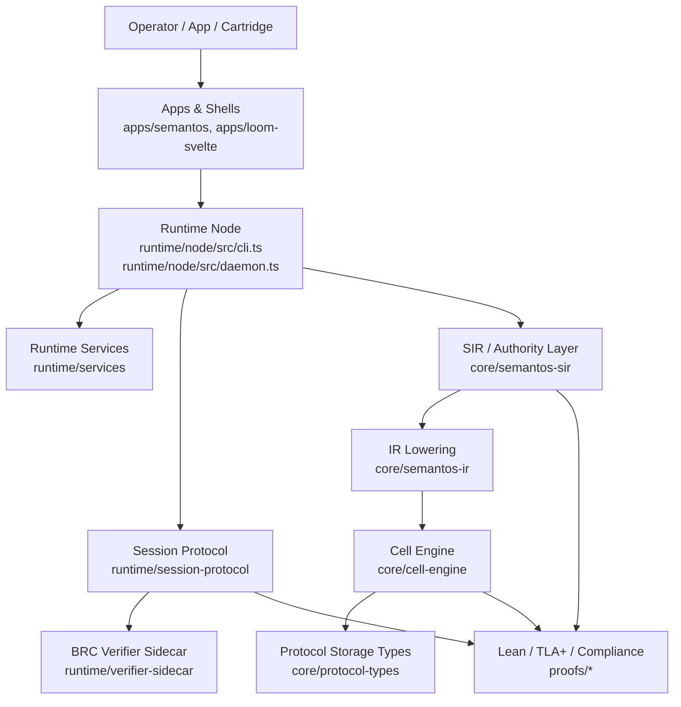
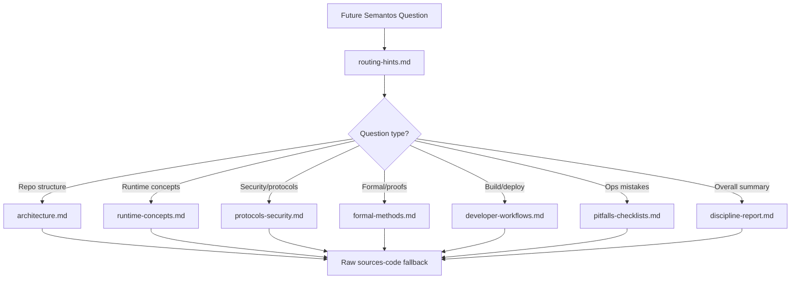

The Semantos discipline build is complete and passed the quality gate.

It produced a durable, code-primary discipline from the `semantos-core` corpus, with layered artifacts covering source mapping, architecture, runtime concepts, protocols/security, storage/data behavior, formal methods, developer workflows, operational pitfalls, routing guidance, final synthesis, and validation.

## Final status

**Result:** PASS  
**Canonical report:** `knowledge/disciplines/Semantos/discipline-report.md`  
**Quality gate:** `knowledge/disciplines/Semantos/quality-gate.md`  
**Source authority:** Semantos source snapshot rooted at:

- `/home/jake/.edwinpai/disciplines/semantos/sources-code`
- Retrieved revision: `7877ddbe35770abaffabf6829f9057102aa40e4f`
- Local checkout inspected: `/home/jake/.edwinpai/disciplines/semantos/state/semantos-core-repo` [1]

The final quality gate explicitly found the discipline to be **code-primary, not docs-dominant**, with major claims grounded in source, tests, proofs, configs, and runtime entrypoints [11].

---

## Layered artifact manifest

The completed discipline includes these artifacts:

1. `knowledge/disciplines/Semantos/source-map.md`  
   Establishes corpus boundaries, source revision context, major file groups, build/test/deploy surfaces, and coverage gaps [1].

2. `knowledge/disciplines/Semantos/architecture.md`  
   Maps the repository architecture across `core/*`, `runtime/*`, `apps/*`, `platforms/*`, cartridges, packages, generated/vendor areas, and proof/test/config surfaces [8].

3. `knowledge/disciplines/Semantos/runtime-concepts.md`  
   Explains runtime concepts, semantic cells, Loom reducer behavior, FlowRunner state machines, session protocol behavior, signed bundles, verifier sidecar flow, and runtime invariants visible in source [2].

4. `knowledge/disciplines/Semantos/protocols-security.md`  
   Covers trust boundaries, BRC verifier sidecar, signed bundle protocol, SIR authority gates, capability/domain/identity/interlock lowering, handoff policy, swarm/access-grant seams, and marked uncertainties [7].

5. `knowledge/disciplines/Semantos/product-model.md`  
   Captures the product/system mental model: Semantos as a semantic coordination platform centered on operator-signed, resource-constrained semantic cells, local-first node operation, gated federation, cartridges/shells, and proof/compliance traceability [6].

6. `knowledge/disciplines/Semantos/formal-methods.md`  
   Connects Lean, TLA+, fuzzing, Zig conformance tests, proof artifacts, and runtime invariants, while explicitly marking verification limits such as Lean-to-Zig refinement gaps and pending proof scenarios [4].

7. `knowledge/disciplines/Semantos/developer-workflows.md`  
   Documents exact build, test, release, deployment, service, mobile/runtime, and operational commands/files from package scripts, CI workflows, Docker/systemd files, Flutter manifests, TLA Makefile, and runtime Makefiles [3].

8. `knowledge/disciplines/Semantos/pitfalls-checklists.md`  
   Provides source conflict rules, common mistakes, safe update workflow, validation checklist, and escalation points for future agents [5][10].

9. `knowledge/disciplines/Semantos/routing-hints.md`  
   Defines `useWhen`, `avoidWhen`, preferred artifacts, raw-source fallback collections, query patterns, and evidence escalation rules for future retrieval [9].

10. `knowledge/disciplines/Semantos/discipline-report.md`  
    The canonical final synthesis, assembling the above into one report with Mermaid diagrams and explicit code/proof/test/config evidence [10].

11. `knowledge/disciplines/Semantos/quality-gate.md`  
    The final acceptance artifact. It verifies required sections, evidence mix, formal/runtime/deploy coverage, routing hints, bounded uncertainty, and rejection of docs-dominant reporting [11].

---

## Evidence model

The discipline follows the required authority order:

1. **Implementation code**
2. **Tests**
3. **Proof/formal artifacts**
4. **Runtime/config/build/deploy files**
5. **Docs/readmes/plans only as secondary hints**

The quality gate confirms that the discipline does not rely mainly on narrative docs. Major claims are grounded in paths such as:

- `package.json`
- `pnpm-workspace.yaml`
- `runtime/node/src/cli.ts`
- `runtime/node/src/daemon.ts`
- `runtime/session-protocol/src/signer.ts`
- `runtime/session-protocol/src/bundle-envelope.ts`
- `runtime/verifier-sidecar/src/verifier.ts`
- `runtime/verifier-sidecar/src/types.ts`
- `core/semantos-ir/src/lower.ts`
- `core/semantos-sir/src/authority.ts`
- `core/semantos-sir/src/lower-sir.ts`
- `core/semantos-sir/src/__tests__/authority.test.ts`
- `core/protocol-types/src/cell-header.ts`
- `core/protocol-types/src/storage.ts`
- `core/protocol-types/src/network.ts`
- `core/protocol-types/src/semantic-fs/__tests__/semantic-search.test.ts`
- `core/cell-engine/src/*.zig`
- `core/cell-engine/tests-bun/proof-of-capability.test.ts`
- `core/cell-engine/proof-artifacts/proof-4-of-7.json`
- `proofs/lean/Semantos.lean`
- `proofs/lean/Semantos/Category.lean`
- `proofs/lean/Semantos/Lexicons.lean`
- `proofs/tla/Makefile`
- `.github/workflows/gate.yml`
- `.github/workflows/tla-verify.yml`
- `proofs/compliance-matrix.json`
- `docker-compose.yml`
- `runtime/semantos-brain/deploy/docker/docker-compose.yml`
- `systemd/semantos-node.service` [1][2][3][4][7][8][10][11]

---

## What the discipline says Semantos is

The synthesized model is:

> Semantos is a semantic coordination platform built around operator-signed, resource-constrained semantic cells, local-first runtime/node execution, gated federation, cartridge/app shells, and proof/compliance traceability.

That conclusion is grounded primarily in runtime/package entrypoints, cell/protocol types, SIR/IR lowering, signed dispatch tests, node daemon code, verifier sidecar code, and proof/compliance artifacts — not marketing docs [2][6][7][8][10].

At a high level:

---

## Runtime and data/control-flow conclusions

The runtime discipline captures several concrete concepts:

- `runtime/node/src/cli.ts` and `runtime/node/src/daemon.ts` are important runtime entrypoints [6][8][11].
- `runtime/session-protocol/src/runtime.ts`, `types.ts`, `signer.ts`, and `bundle-envelope.ts` define important session and signed-bundle behavior [2][7].
- `runtime/verifier-sidecar/src/server.ts`, `types.ts`, and `verifier.ts` define a BRC verifier sidecar boundary [2][7].
- `runtime/services/src/types/loom.ts`, `services/loom/loom-reducer.ts`, `visibility-rules.ts`, and `loom-atoms.ts` ground the Loom state/reducer model [2].
- `core/protocol-types/src/cell-header.ts`, `storage.ts`, and `network.ts` ground the protocol/data model [2][11].
- `core/semantos-sir/src/authority.ts`, `lower-sir.ts`, and `types.ts` ground authority and lowering behavior [7][8].
- `core/cell-engine/src/linearity.zig`, `pda.zig`, `executor.zig`, and `opcodes/plexus.zig` ground low-level cell-engine behavior and formal-methods connections [4].

The final report includes diagrams for:

- repository/runtime architecture,
- runtime data/control flow,
- storage/event flow,
- BRC verifier sequence,
- proof/test traceability [10].

---

## Protocols and security conclusions

The security layer was handled cautiously and source-first.

Grounded claims include:

- A BRC verifier sidecar exists and forms a trust boundary, based on `runtime/verifier-sidecar/src/types.ts`, `verifier.ts`, and sidecar tests [7].
- Signed bundle behavior is grounded in `runtime/session-protocol/src/signer.ts` and `bundle-envelope.ts` [7].
- Authority and scope behavior is grounded in `core/semantos-sir/src/authority.ts`, `lower-sir.ts`, `types.ts`, and `core/semantos-sir/src/__tests__/authority.test.ts` [7].
- Capability/domain/identity/interlock lowering is treated as security-sensitive and tied to SIR/lowering evidence [7].
- Handoff policy authorization is grounded in `runtime/session-protocol/src/handoff-policy.ts` [7].
- Host/crypto assumptions remain bounded, especially around production SPV provider config and whether every mutating adapter invokes `BrcVerifier` [7].

Important uncertainties were explicitly marked rather than overclaimed:

- Whether every mutating adapter invokes `BrcVerifier`.
- The concrete adapter path from `BrcVerifier` to `AuthorityVerifier.verifyAuthority()`.
- Production SPV-provider configuration.
- Full swarm/access-grant preimage details without deeper file review [7].

That bounded-uncertainty behavior was accepted by the quality gate [11].

---

## Formal methods conclusions

The formal-methods layer connects implementation behavior to proof/test artifacts, but it does **not** overclaim full mechanical verification.

Covered surfaces include:

- Lean theorem layer:
  - `proofs/lean/Semantos.lean`
  - `proofs/lean/Semantos/Category.lean`
  - `proofs/lean/Semantos/Lexicons.lean`
  - K-invariant theorem modules
  - `CryptoAxioms.lean` [4]

- TLA+ layer:
  - `proofs/tla/*.tla`
  - `proofs/tla/*.cfg`
  - `proofs/tla/Makefile`
  - `.github/workflows/tla-verify.yml` [4][11]

- Implementation grounding:
  - `core/cell-engine/src/linearity.zig`
  - `core/cell-engine/src/pda.zig`
  - `core/cell-engine/src/executor.zig`
  - `core/cell-engine/src/opcodes/plexus.zig` [4]

- Test/fuzz/proof bridge:
  - Zig conformance tests
  - Lean-derived vectors
  - Bun oracle fuzzers
  - cell-engine fuzz harnesses
  - `core/cell-engine/tests-bun/proof-of-capability.test.ts`
  - `core/cell-engine/proof-artifacts/proof-4-of-7.json` [4][7]

Verification boundaries were explicitly recorded:

- Lean-to-Zig refinement gap.
- Crypto axioms are trusted assumptions.
- TLA models are finite/config-bounded.
- Host imports are trusted boundaries.
- `proof-4-of-7.json` still has scenarios 5–7 marked `PENDING`, so the discipline does not claim those scenarios are fully proved/implemented [2][4][11].

---

## Developer workflows

The developer-workflows artifact grounds build/test/release/deploy behavior in executable files and configs:

- Root workspace/package scripts:
  - `package.json`
  - `pnpm-workspace.yaml` [3][8]

- CI:
  - `.github/workflows/gate.yml`
  - `.github/workflows/build-all-targets.yml`
  - `.github/workflows/release.yml`
  - `.github/workflows/release-binaries.yml`
  - `.github/workflows/tla-verify.yml` [3][4][11]

- Deployment/service:
  - `Dockerfile`
  - `docker-compose.yml`
  - `docker-compose.sidecar.yml`
  - `runtime/semantos-brain/deploy/docker/docker-compose.yml`
  - `systemd/semantos-node.service` [3][5]

- Runtime/mobile:
  - `runtime/node/package.json`
  - `runtime/services/package.json`
  - `runtime/session-protocol/package.json`
  - `apps/semantos/pubspec.yaml`
  - Flutter/platform package manifests [3][6]

- Formal workflow:
  - `proofs/tla/Makefile`
  - Lean invocation through CI [3][4]

The discipline’s future-agent rule is: prefer exact package scripts and CI commands over prose instructions [3][5][9].

---

## Operational pitfalls and future-agent guidance

The pitfalls/checklists layer establishes the discipline’s operational posture:

- Code/proof/test/config precedence beats docs/readmes/plans [5].
- Validate against actual source paths before making architectural claims [5][9][11].
- Do not claim full verification where proof artifacts are pending or axiomatic [4][11].
- Treat generated/vendor/archive areas carefully [8].
- Fall back to raw sources when layered artifacts are too general [9].
- Use routing hints to choose the right artifact before searching the full corpus [9].

The recommended retrieval flow is:

This was accepted as actionable in the quality gate [9][11].

---

## Commits produced

The subtask results report these commits:

- `5b3e8df Add Semantos source map artifact` [1]
- `6f85e9b Add Semantos runtime concepts artifact` [2]
- `0b7ebf8 Add Semantos developer workflows artifact` [3]
- `6b9a69c Add Semantos formal methods artifact` [4]
- `501ab6c Add Semantos pitfalls checklist artifact` [5]
- `2592a97 Add Semantos product model artifact` [6]
- `291b038 Add Semantos protocols security artifact` [7]
- `9a9c5a5 Add Semantos architecture artifact` [8]
- `73324a1 Add Semantos routing hints artifact` [9]
- `56c9f12 Add Semantos discipline final report` [10]
- `e38099b Add Semantos quality gate artifact` [11]

One caveat was noted: the workspace already had unrelated modified/untracked files before the task, and the subtasks committed only the requested artifacts [5][11].

---

## Quality-gate verdict

The final quality gate returned:

**PASS** [11]

It verified that:

- all required layered artifacts are present;
- the report is code-primary, not docs-dominant;
- major claims cite concrete source/proof/test/config/runtime paths;
- formal/runtime/deploy surfaces are covered;
- `useWhen` / `avoidWhen` retrieval hints are actionable;
- unsupported or uncertain claims are bounded;
- the report does not invent implementation plans or claim more than the code/proofs/tests support [11].

In short: the Semantos discipline is now usable by future agents as a durable, source-grounded knowledge layer for the `semantos-core` codebase.