# Semantos Core — Architectural Diagrams

Source of truth: `docs/canon/` — all canonical terminology from the 2026-04-26 glossary decision pass.

**Canonical term quick-ref**: cell (not SemanticObject), hat (not facet), Helm (not Loom), capability token (not permission-token), cell engine (not PDA/2-PDA in prose), governance domain (not trust domain).

---

## 1. Three Cybernetic Orders

The substrate is structurally three-order cybernetic. This is the fundamental architectural claim.

```mermaid
graph TB
    subgraph Third["3rd Order — Many observers observing each other"]
        direction LR
        F1["Federation\nmany Pask kernels on sovereign nodes\nobserving each other via Pravega streams"]
        GD["Five Governance Domains\nTrust · Estate · Realm · Corporate · Cooperative\neach a distinct 3rd-order structure"]
        LEX["Lexicons\nformalised community vocabularies\nLean proof of headerInjective per lexicon"]
        EG["Extension Grammar\nmeta-mechanism for communities entering substrate\nextension manifest = community's self-observation\nagainst lexicon obligations"]
        K3["K3 Domain Isolation\nenforced at cell engine boundary\nOP_CHECKDOMAINFLAG"]
    end

    subgraph Second["2nd Order — System observing itself"]
        direction LR
        PK["Pask Kernel\nConversation Theory (Pask 1976) in Zig\npask_node_is_stable = system watching own learning\nstable thread = confirmed cross-kernel agreement"]
        CG["Compression Gradient\nteachback pipeline\nsource→AST→SIR→OIR→bytecode→action→outcome\neach stage reflects on previous"]
        JUR["Jural Categories\ndeclaration · obligation · permission\nprohibition · power · condition · transfer\n2nd-order attribution of meaning to mechanism"]
        K2["K2 Authorisation\nstate change requires identity verification\nsystem reflects on who acts"]
    end

    subgraph First["1st Order — Observer-independent control"]
        direction LR
        CE["Cell Engine\n2-PDA, ~4,900 LOC Zig\nK1–K7 invariants at bytecode gate\nno self-reference (breaks K5 argument)"]
        LMDB["LMDB Storage\ndumb observer-independent storage\ncell engine is the verifier"]
        K1["K1 Linearity\nK4 Failure Atomicity\nK5 Bounded Termination\nK6 Hash-chain Integrity\nK7 Cell Immutability"]
    end

    Third -->|"K3 boundary enforcement"| Second
    Second -->|"OIR → 1st-order mechanism"| First

    style Third fill:#e8f5e9,stroke:#388e3c
    style Second fill:#e3f2fd,stroke:#1565c0
    style First fill:#fff3e0,stroke:#e65100
```

---

## 2. Compression Gradient — Teachback Pipeline

Each stage is the system explaining the previous stage to itself. Pask's teachback criterion compiled into a static-analysis pipeline.

```mermaid
flowchart LR
    S0["0x00 source\nRELEVANT\nraw evidence\nnot yet reflected upon"]
    S1["0x01 parse\nLINEAR\nAST extracted\nstructural extraction of surface"]
    S2["0x02 ast\nAFFINE\naccumulated state\nsubstrate has structural object"]
    S3["0x03 typecheck\nRELEVANT\nclassification scores\njural category attributed"]
    S4["0x04 optimise\nLINEAR\nSIR program\nmeaning in typed annotations"]
    S5["0x05 codegen\nRELEVANT\nOIR + bytecode\nmechanism produced from meaning"]
    S6["0x06 action\nLINEAR\ncell engine executes\nbytecode runs"]
    S7["0x07 outcome\nRELEVANT\nresult cell\nnew source for next pass"]

    S0 -->|"parse\nK4 atomicity on fail\nno trace left"| S1
    S1 --> S2
    S2 -->|"AST→SIR\nSTRONGEST GATE\njural category\ntaxonomy\ngovernance context\nidentity binding"| S3
    S3 --> S4
    S4 -->|"SIR→OIR\nlowerSIR : SIR → Error + OIR\nalpha-equivalence guarantee\nsame meaning → byte-identical bytecode"| S5
    S5 -->|"OIR→bytecode\nANF-to-opcode\nnear-mechanical"| S6
    S6 -->|"K1 K3 K4 K5 K6 K7\nviolation halts + rolls back"| S7
    S7 -.->|"outcome becomes new source\nloop closes"| S0

    subgraph Levels["Cybernetic order at each stage"]
        L1["source: pre-cybernetic"]
        L2["AST: 1st-order (mechanism, no meaning)"]
        L3["SIR: 2nd-order (system's reflection: jural category, lexicon, who acts)"]
        L4["OIR: 1st-order (mechanism checking 2nd-order claim)"]
        L5["outcome cell: 2nd-order (persistent self-observation record)"]
        L6["Pravega event: 3rd-order (federation's record of local observation)"]
    end
```

---

## 3. System Layer Architecture

Five tiers with enforced unidirectional imports. Gate: `tests/gates/import-boundaries.test.ts`.

```mermaid
graph TB
    subgraph APPS["APPS (Tier 3)"]
        A1[oddjobtodd\ntrades vertical]
        A2[property-mgmt\nproperty vertical]
        A3[Helm\nworkbench shell]
        A4[demo-collab\nversioning demo]
        A5[poker-agent]
        A6[piggybank]
    end

    subgraph EXT["EXTENSIONS (Tier 2 — Domain Algorithms)"]
        E1[policy-runtime\nopcode evaluator +\nD-A6 authority gate]
        E2[cdm\nISDA CDM lifecycle]
        E3[extraction\n5-stage ETL pipeline]
        E4[chain-broadcast\nBSV tx + BEEF]
        E5[metering\npayment-channel FSM]
        E6[oddjobz\nD-O1–O11 deliverables]
        E7[navigator\ntype-driven routing]
        E8[calendar\nbooking/scheduling]
    end

    subgraph RUNTIME["RUNTIME (Tier 1 — Entry Surfaces)"]
        R1[shell\nCLI/REPL + Lisp compiler]
        R2[node\ndaemon + admin API]
        R3[services\nrenderer-agnostic stores]
        R4[session-protocol\nmulti-party FSM]
        R5[peer-locator\nBCA → WSS endpoint]
        R6[ws-node-adapter\nfederation transport]
        R7[intent\nNLU pipeline]
        R8[world-beam\nElixir bridge]
        R9[verifier-sidecar\nD-V1–V3 crypto verification]
    end

    subgraph CORE["CORE (Tier 0 — Kernel Foundation)"]
        C1[cell-engine\nZig WASM 2-PDA\nK1–K7 enforcement]
        C2[pask\nZig WASM learning kernel\nConversation Theory]
        C3[pask-and-cell\ncombined build\nshared linear memory]
        C4[protocol-types\nbridge + ContentStore interfaces]
        C5[cell-ops\ncell packing + type-hash registry]
        C6[semantic-objects\nappend-only patch substrate\nDrizzle + Postgres]
        C7[semantos-ir\nANF OIR layer]
        C8[semantos-sir\nSIR + jural types]
        C9[identity-ports\nport-based DI surface]
        C10[plexus-contracts\nBRC-52/42/100 types]
        C11[plexus-vendor-sdk\nidentity DAG + BKDS]
        C12[state\nreactive cell primitives]
        C13[world-sdk\nRelay client + CellDag]
    end

    subgraph PLATFORMS["PLATFORMS"]
        P1[browser\nembedded WASM 29 KB]
        P2[node.js\nfull WASM 185 KB]
        P3[esp32\nIoT embedded]
    end

    APPS -->|"may import"| EXT
    APPS -->|"may import"| RUNTIME
    EXT -->|"may import"| RUNTIME
    EXT -->|"may import"| CORE
    RUNTIME -->|"may import"| CORE
    CORE --> PLATFORMS
```

---

## 4. Cell Wire Format (1024 bytes)

The canonical data primitive. Everything stored, evaluated, and chained is a cell.

```
┌────────────────────────────────────────────────────────────────────────┐
│  CELL HEADER  (256 bytes, offsets 0–255)                               │
├─────────┬──────┬─────────────────────────────────────────────────────  │
│ offset  │ size │ field                                                  │
├─────────┼──────┼─────────────────────────────────────────────────────  │
│ 0       │ 16   │ Magic  DE AD BE EF  CA FE BA BE  13 37 13 37  42 42   │
│ 16      │ 4    │ Linearity  uint32 LE  0=LINEAR 1=AFFINE 2=RELEVANT    │
│ 20      │ 4    │ Version  uint32 LE  monotonic state counter            │
│ 24      │ 4    │ DomainFlag  uint32 LE  §4.5 governance domain          │
│ 28      │ 2    │ RefCount  uint16 LE                                    │
│ 30      │ 32   │ TypeHash  SHA-256(whatPath : howSlug : instPath)       │
│ 62      │ 16   │ OwnerID  BCA-derived identifier                        │
│ 78      │ 8    │ Timestamp  uint64 LE  ms since Unix epoch              │
│ 86      │ 4    │ CellCount  total cells incl. continuations             │
│ 90      │ 4    │ PayloadSize  payload bytes in Cell 0 (≤ 768)           │
│ 94      │ 1    │ Phase  0x00–0x07  compression-gradient stage           │
│ 95      │ 1    │ Dimension  0x00=composite 0x01=WHAT 0x02=HOW 0x03=INST │
│ 96      │ 32   │ ParentHash  SHA-256 of parent cell (structural)        │
│ 128     │ 32   │ PrevStateHash  SHA-256 of previous state (temporal)    │
│ 160     │ 96   │ Reserved  zero-padded forward-compat                   │
└─────────┴──────┴─────────────────────────────────────────────────────  │
                                                                          │
┌────────────────────────────────────────────────────────────────────────┐
│  SEMANTIC PAYLOAD  (768 bytes, offsets 256–1023)                       │
│  domain-specific content, zero-padded                                  │
└────────────────────────────────────────────────────────────────────────┘

┌────────────────────────────────────────────────────────────────────────┐
│  CONTINUATION CELLS  (1024 bytes each, optional)                       │
│                                                                        │
│  0x01 BUMP         Bitcoin UTXO merkle proof                           │
│  0x02 ATOMIC_BEEF  SPV ancestry proof (0x01010101 prefix, BRC-95)     │
│  0x03 ENVELOPE     multi-cell container                                │
│  0x04 DATA         untyped data                                        │
│  0x05 STATE        mutable state snapshot                              │
│                                                                        │
│  Auxiliary stack pops in reverse order so BUMP is verified first       │
│  (fail-fast: bad anchor → skip BEEF + STATE computation)               │
└────────────────────────────────────────────────────────────────────────┘
```

---

## 5. Linearity Type System

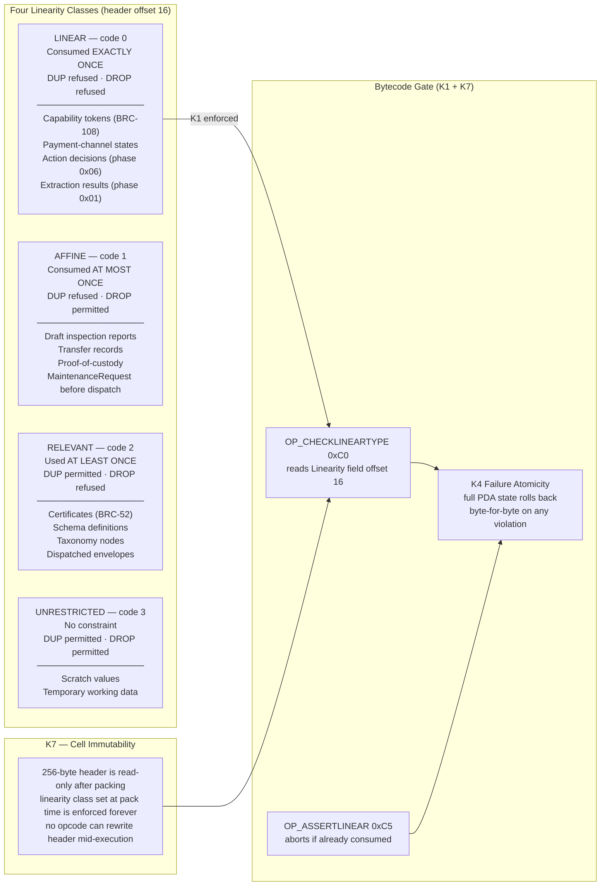

---

## 6. Kernel Composition (Cell Engine + Pask + DB)

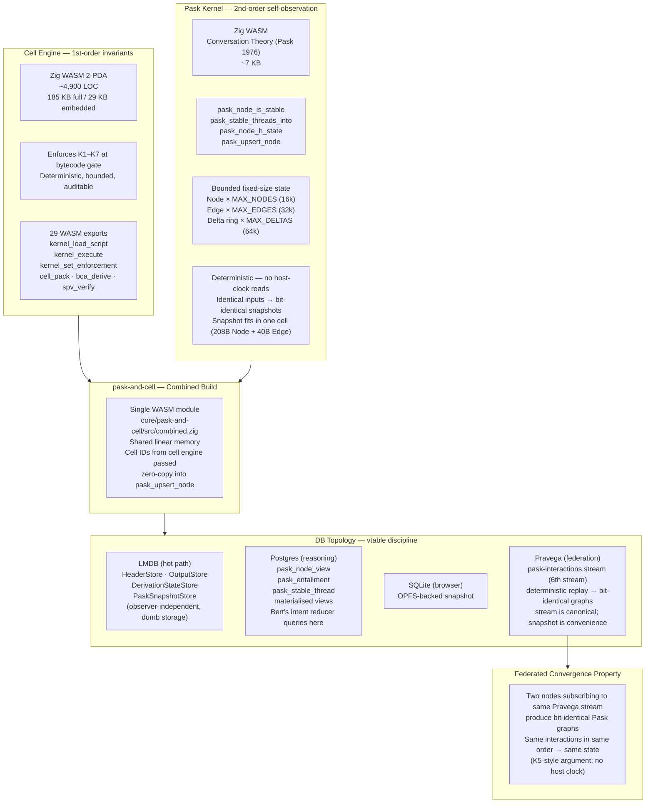

---

## 7. Boot Sequence — Cold Start to K1–K10 Compliance

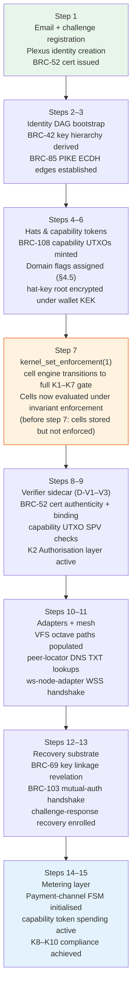

---

## 8. Identity Architecture — BRC Standards Stack

```mermaid
flowchart TB
    subgraph BRCStack["BRC Standards (BRC-42/52/69/85/94/95/100/103/108)"]
        BRC42["BRC-42 — Client-side Key Derivation\nPBKDF2 100k iterations\ndeterministic child keys under parent cert\nBKDS: (protocolID, keyID, counterparty)"]
        BRC52["BRC-52 — Certificate ID Standard\ncertId = SHA-256(JSON { public_key,\n  parent_cert_id, child_index, email, resource_id })\n33-byte secp256k1 pubkey"]
        BRC69["BRC-69 — Key Linkage Revelation\nRecovery substrate\nrecovering device reconstructs ECDH\nPlexus never holds secret"]
        BRC85["BRC-85 — PIKE Protocol\nECDH for edge establishment in identity DAG"]
        BRC94["BRC-94 — Verifiable Revelation\nSchnorr ZK proof\nedge-presence proof in attestations"]
        BRC100["BRC-100 — Signed Request Standard\nEvery cross-process message:\n  x-brc100-identitykey\n  x-brc100-nonce (replay protection)\n  x-brc100-timestamp\n  x-brc100-signature (secp256k1)\n  x-brc52-certificate"]
        BRC103["BRC-103 — Mutual Auth Handshake\nedge-creation transcript binding\nTOFU prevention in recovery"]
        BRC108["BRC-108 — Identity-Linked Token\nCapability UTXOs bound to BRC-52 cert\nSpending atomically revokes token\nLINEAR semantic resource (K1 enforced)"]
    end

    subgraph PortLayer["Port-Based DI (core/identity-ports)"]
        IP["identityPort\nregisterIdentity · resolveIdentity\nderiveChild · createEdge · querySubtree"]
        RP["recoveryPort\ninitiateRecovery · submitChallenge"]
        AP["attestationPort\nattest SPV · verifyAttestable"]
        CP["capabilityPort\ncheckCapability · tokenIsValid"]
        BIND["identityPort.bind(impl) at boot\nTest: stub adapter\nProduction: VendorSDK adapter"]
    end

    subgraph BKDS["Sovereignty — BKDS Key Derivation"]
        ROOT["hat-key root\n32-byte secret\nAES-GCM-encrypted\n~/.semantos/data/brain/hat-root.enc"]
        DERIVED["Per-cell signing key\nBRC-42 BKDS under\n(protocolID='oddjobz.cell-sign/v1',\n keyID=<cell-content-hash>,\n counterparty=<operator-domain-identity>)\nKey exists for ONE signature, then discarded"]
        THREAT["Compromise classes:\n- Single derived key → only that cell\n- Wallet KEK leak → rotate root immediately\n- hat-key root → re-derive via BRC-52 + BRC-42 recovery\n- Cell payload tamper → signature fails (keyID changes)"]
    end

    BRC42 --> BKDS
    BRC52 --> PortLayer
    BRC108 --> CP
    ROOT --> DERIVED
    DERIVED --> THREAT
```

---

## 9. Five Governance Domain Types (3rd-order structures)

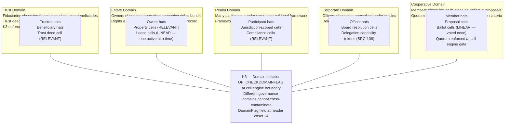

---

## 10. MNCA as Pask Federation

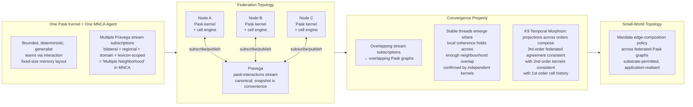

---

## 11. Two-IR Pipeline (SIR + OIR)

The fundamental reason for two intermediate representations: SIR carries meaning, OIR carries mechanism.

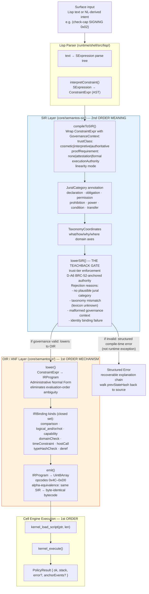

---

## 12. BRC Standards Mapping

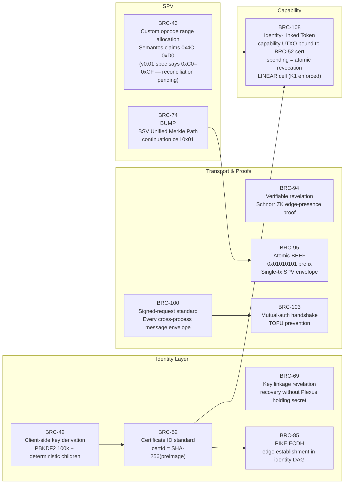

---

## 13. Cell Patch Substrate — Hash Chain

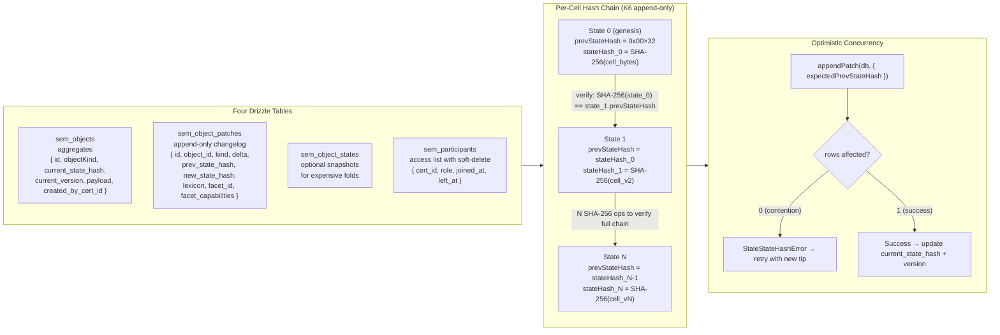

---

## 14. Cross-Vertical Dispatch (Trades ↔ Property)

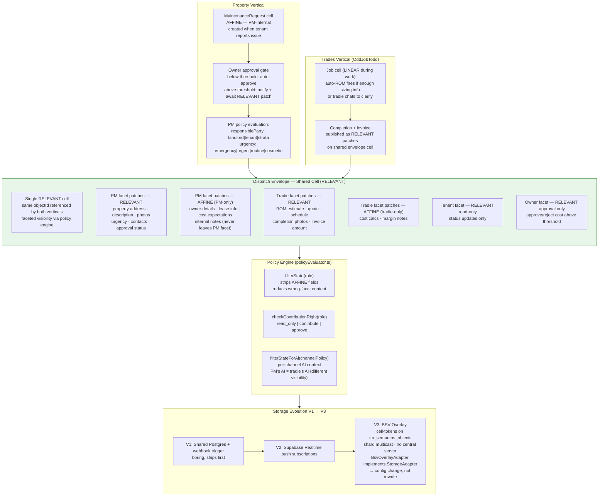

---

## 15. Federation Transport & Relay Protocol

```mermaid
sequenceDiagram
    participant A as Node A
    participant DNS as DNS TXT\n_semantos-node.<host>
    participant B as Node B
    participant PR as Pravega\npask-interactions stream
    participant Relay as cell-relay\nWebSocket room

    Note over A: peer-locator: DnsPeerLocator with TTL cache
    A->>DNS: lookup _semantos-node.<host>
    DNS-->>A: { endpoint: wss://..., bca: "..." }

    Note over A,B: ws-node-adapter
    A->>B: WSS connect
    B->>A: BRC-100 SignedBundle license handshake
    A->>B: BRC-103 mutual-auth response
    Note over A,B: CBOR envelope codec active

    Note over A,B: session-protocol MulticastAdapter
    A->>B: broadcast cell (CBOR)
    B->>B: appendPatch(db, { facetId: Node A's BCA })
    B-->>A: acknowledgement patch (RELEVANT)

    Note over A,PR: pask-interactions stream
    A->>PR: publish pask interaction event
    PR-->>B: deliver same event (6th Pravega stream)
    B->>B: pask_upsert_node (zero-copy from cell engine)
    Note over A,B: Both nodes produce bit-identical Pask graphs\n(K5-style determinism; no host clock)

    Note over A,Relay: world-sdk RelayClient
    A->>Relay: subscribe room=release.kernel.pask
    Relay-->>A: release manifest (BRC-100 SignedBundle CBOR)
    A->>A: validate parentChain + content hashes
    A->>A: fetch WASM via ContentStore (6 adapter options)
```

---

## 16. Lexicon Architecture

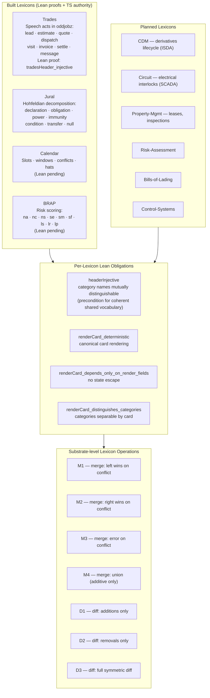

---

## 17. End-to-End: Tradie Job (Concrete Trace)

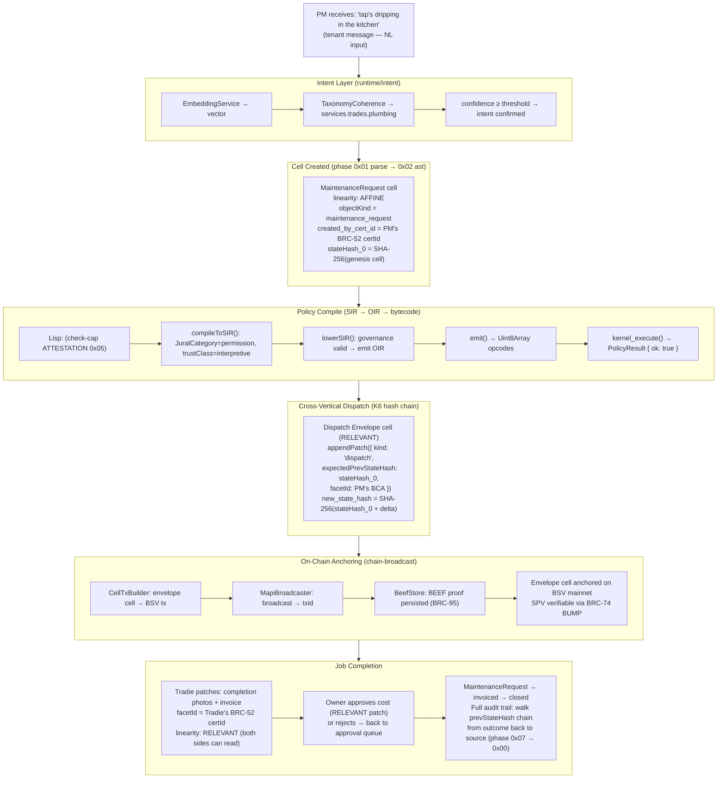

---

*All diagrams grounded in `docs/canon/` as the source of truth.*  
*Canonical terminology enforced: cell (not SemanticObject), hat (not facet), Helm (not Loom), governance domain (not trust domain).*  
*Kernel invariants K1–K10: `proofs/lean/Semantos/Theorems/` + `docs/canon/theorems.yml`.*
