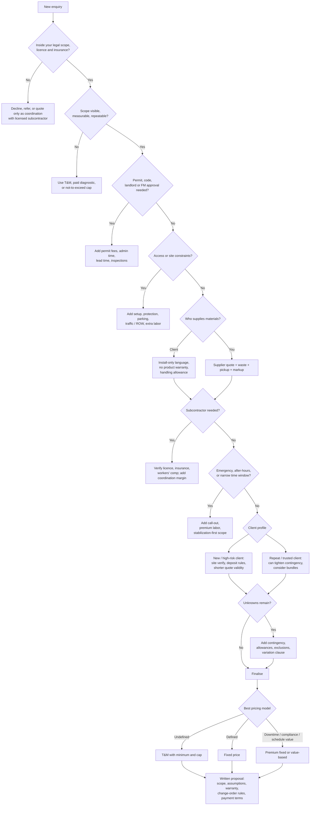

# Estimating Small Jobs for a Handyman Business

## Executive summary

A reliable handyman estimate is not just a price; it is a short-form project plan. The strongest estimates follow a repeatable sequence: qualify the request, inspect or verify the scope, screen for licensing and permit issues, build direct job costs, decide whether the job is fit for fixed pricing or should stay on time-and-materials, and then issue a written proposal that states assumptions, exclusions, warranty terms, and change-order rules. That sequence is consistent with formal estimating practice published by the American Society of Professional Estimators, small-business break-even guidance from the U.S. Small Business Administration, and contract structures published by the National Association of Home Builders. citeturn31view1turn35view0turn28view0

For a handyman business, the single biggest pricing mistake is confusing a worker’s wage with a customer-facing sell rate. U.S. Bureau of Labor Statistics wage data are a useful floor, but they do not include non-billable estimating time, vehicle expense, tools, insurance, callbacks, cleanup, admin time, or profit. That is why consumer-market handyman rates are materially higher than payroll wage benchmarks. In current U.S. market samples, Angi reports roughly $50–$150 per hour, while Thumbtack reports a national average of about $60–$75 per hour, with low-end and high-end ranges extending beyond that; in Australia, hipages reports around A$55–A$85 per hour, with higher pricing for holidays, weekends, and rush jobs. citeturn17view0turn17view2turn32view0turn17view3

The practical rule is simple: use **fixed price** only when the work is visible, measurable, and repeatable. Use **time-and-materials** or a **paid diagnostic / not-to-exceed structure** when there are hidden conditions, active leaks, unknown substrates, old-building hazards, or permit uncertainty. Handyman work often sits precisely at the boundary where “small job” meets “real construction risk,” so disciplined scoping matters more than on larger projects. BLS notes that general maintenance and repair workers routinely estimate repairs and costs, but also coordinate licensed specialists when the work is above their skill level or requires greater expertise. citeturn17view0turn31view0

Regional variation is not a side issue; it is one of the core pricing inputs. Permit exemptions, licensing thresholds, written-contract requirements, right-of-way rules, waste disposal charges, and even salesperson cancellation notices can all change the quote. For example, NYC distinguishes emergency work from ordinary repairs, San José requires permits for water heater replacement, Seattle exempts some minor repairs but requires right-of-way permits for public-street impacts, California allows some unlicensed minor work below a monetary threshold only if no permit and no workers are involved, and Queensland requires written contracts for domestic building work over A$3,300, with electrical and plumbing work requiring licensed practitioners regardless of price. citeturn17view5turn17view6turn3search0turn27view0turn30view1turn26view0turn36search18

A good estimate therefore prices three things at once: the visible task, the jobsite conditions, and the business risk. If you price only the visible task, your close rate may look good, but your gross margin, callback rate, and cash flow will deteriorate. If you price the task, site, and risk explicitly, you can quote faster, defend your numbers more confidently, and decide earlier when to decline, refer, or subcontract. citeturn35view0turn17view7turn30view2turn30view3

## Estimation framework

The framework below is designed to work across residential and small commercial jobs. It borrows the discipline of formal construction estimating, but is simplified for service work where time, access, and uncertainty matter as much as raw quantities. citeturn31view0turn31view1turn35view0

| Step | What to do | Output you need before pricing | Why it matters |
|---|---|---|---|
| Intake and fit check | Capture client, site, photos, requested outcome, deadline, occupancy, and whether the work appears to sit inside your legal scope and insurance envelope. | Go / no-go decision. | Small jobs are often lost on legality or access rather than labor. citeturn17view0turn17view7turn30view2 |
| Scope verification | Decide whether photos are enough or a site visit is required. Confirm dimensions, substrates, access path, parking, utilities shutoff needs, furniture moving, and finish expectations. | Verified scope notes, measurements, photos. | Formal estimating begins with accurate quantity and condition input; handyman work adds setup and access friction. citeturn31view1turn31view0turn24view1 |
| Regulatory screen | Check whether the job triggers licensed trade work, permits, landlord/facility approval, lead-safe rules, asbestos concerns, or right-of-way permits. | Compliance path. | Permit exemptions never excuse code violations; old-building hazards and utility work can radically alter scope. citeturn19view0turn25view0turn25view3turn27view0 |
| Pricing model choice | Choose fixed price, T&M, or staged diagnostic plus repair. | Pricing method. | Fixed pricing is best for defined work; unknowns belong in T&M or allowance structures. citeturn35view0turn28view0turn32view2 |
| Direct labor build | Estimate productive labor, setup/teardown, material pickup, protection, cleanup, admin, permit time, and return trips. | Total billable hours by labor type. | BLS confirms repair workers estimate repairs and costs; SBA break-even guidance requires separating variable and fixed costs. citeturn17view0turn35view0 |
| Materials and consumables | Price purchased items, freight, waste, small consumables, and whether the client or you will supply them. | Material cost basis and markup policy. | Material sourcing creates real admin, warranty, and travel costs even on “small” jobs. citeturn32view0turn28view0turn34view1 |
| Site friction and travel | Add travel, parking, loading, protection, restricted hours, stair carry, ladder/scaffold setup, and disposal. | Jobsite condition allowances. | OSHA ladder rules, right-of-way rules, and municipal tipping fees directly change cost and risk. citeturn24view1turn27view0turn27view2turn15search0turn15search1 |
| Subcontracting and specialist input | Obtain sub quotes where required, verify licence / workers’ comp / insurance, and decide whether you are simply referring or actively managing the work. | Subcontractor cost plus coordination policy. | Prime contractors can inherit liability if subs are not properly covered or supervised. citeturn30view2turn30view3turn26view3 |
| Contingency and client-risk overlay | Price hidden conditions, older-building risk, rush work, new-client risk, financing risk, quote-validity window, and callback exposure. | Contingency or exclusions. | SBA explicitly recommends throwing extra into break-even analysis for miscellaneous expenses; old-building lead/asbestos risks justify stronger exclusions. citeturn35view0turn25view0turn25view3 |
| Proposal and conversion | Issue written scope, exclusions, assumptions, schedule, warranty language, payment terms, variation process, and cancellation notices where required. | Defensible quote. | NAHB, QBCC, FTC, and business.gov.au all stress written contracts, change handling, and clear responsibility allocation. citeturn28view0turn26view0turn26view2turn26view3turn34view0 |

A practical pricing formula for small jobs is:

```text
Quote
= direct labor
+ materials and consumables
+ subcontractors
+ travel / vehicle / parking
+ setup, protection, cleanup, disposal
+ permit / admin / coordination time
+ contingency or allowances
+ overhead recovery and profit
- bundle or loyalty discounts if strategically justified
```

That formula is just a service-business version of SBA’s break-even logic: you are converting fixed costs, variable costs, and target contribution into a price that still works when the job is not perfectly efficient. citeturn35view0turn21view0turn17view7

The most useful operational test is to ask one question before every quote: **“If I open this up or get on site and the hidden condition is worse, what mechanism in my quote lets me recover the extra cost?”** If the answer is “nothing,” the pricing model is wrong. citeturn28view0turn26view3turn25view3

## Decision logic

The decision tree below shows the core branching logic that a handyman estimator should apply before committing to a number. It compresses legal, operational, and pricing decisions into one sequence so you can standardise quoting across residential and commercial small jobs. The branches are grounded in job-role boundaries described by BLS, permit and licensing examples from local authorities, OSHA access rules, EPA lead/asbestos triggers, FTC cancellation and warranty rules, and written-contract guidance from NAHB, QBCC, and business.gov.au. citeturn17view0turn19view0turn17view6turn24view1turn25view0turn25view3turn34view0turn34view1turn28view0turn26view0turn26view3



The chart becomes genuinely useful when it is paired with a pricing-action table. That is where edge cases stop being “I’ll deal with that later” and start becoming quote line items or explicit exclusions.

| Decision branch | What to ask | Estimating action |
|---|---|---|
| Labour versus materials | Is this mostly labor, or does procurement dominate? | Labor-heavy jobs need strong minimum charges; material-heavy jobs need markup, freight, pickup time, and waste allowance. If the client supplies materials, remove markup but add handling / verification time and carve out product warranty. citeturn32view0turn34view1turn28view0 |
| Access and site constraints | Stairs only, occupied office, narrow service window, no loading zone, fragile finishes, ladder work, public footpath impact? | Add setup, protection, barricading, helper time, parking / street-use costs, and lower productivity assumptions. OSHA requires stable ladder use, inspections, and controls in traffic paths; some ROW use requires permits. citeturn24view1turn27view0turn27view2 |
| Permits and regulations | Does the work touch structure, plumbing, gas, electrical, hot water, fire systems, public ROW, or older painted surfaces? | Either stop and refer, or quote permit/admin/subcontract time explicitly. Local examples: ordinary repairs may be exempt in NYC, but associated plumbing/electrical/sidewalk work may still require filing; San José requires permits for water heaters; Seattle requires permits for ROW work. citeturn19view0turn17view5turn17view6turn27view0 |
| Warranty and guarantee | Are you warranting workmanship only, or also supplied products? | Separate workmanship warranty from manufacturer product warranty. Put both in writing and define exclusions for owner-supplied materials, misuse, hidden conditions, and unrelated failures. citeturn34view1turn26view3turn28view0 |
| Subcontracting | Do you need a licensed plumber, electrician, glazier, roofer, or asbestos / lead professional? | Get written sub quotes, verify registration / insurance / workers’ comp, and price coordination. If you direct subs or use uninsured subs, your liability can rise sharply. citeturn30view2turn30view3turn26view3 |
| Travel and time windows | How far is the site, and when can you work? | Recover mileage or zone-based travel, and add premiums or minimums for wasted setup time on short windows. IRS mileage guidance is a useful vehicle-cost anchor. citeturn21view0turn32view0 |
| Emergency and after-hours | Is this “make safe now, repair later”? | Split the quote into stabilization and permanent repair. Emergency work should carry a call-out structure and narrower scope than a normal repair quote. Some authorities allow emergency work before permit issuance, but with follow-up filing. citeturn17view5turn17view0turn17view3 |
| Client risk tolerance | Does the client want price certainty or low entry cost? | High-certainty clients will tolerate a higher fixed price; price-sensitive clients may prefer T&M or a diagnostic-first phase. This is classic cost-versus-risk allocation. citeturn35view0turn28view0 |
| Repeat versus new client | Do you know the site, payment behavior, and standards already? | Repeat clients justify tighter contingencies and bundles; new clients justify stronger verification, shorter quote validity, and stricter payment terms. citeturn35view2turn26view3 |
| Bundled discounts | Are several small tasks on one visit? | Bundle to cut dead travel and setup time, then share some of the efficiency with the client as a discount. Small jobs often become more profitable when combined. citeturn32view0turn17view2 |
| Disposal and cleanup | Is there debris, old fixtures, transfer-station cost, or private carting requirement? | Price haul-away separately or as a pass-through with handling. Municipal examples show that disposal rules and fees vary significantly. citeturn15search0turn15search1turn15search2 |
| Insurance and liability | Is the site asking for COI, additional insured, product liability, or specific coverage? | Confirm coverage before quoting. General liability, professional liability for services, commercial property, and workers’ comp may all affect pricing. citeturn17view7turn30view2 |
| Unknowns and contingencies | Could opening the wall, removing trim, or touching old finishes reveal more work or hazards? | Use contingencies for bounded uncertainty; use T&M or staged approval when the uncertainty is unbounded. Pre-1978 lead rules and suspect asbestos are stop-and-screen triggers. citeturn25view0turn25view1turn25view3 |

## Pricing models, margins, and contingencies

A handyman business should treat pricing as a controlled balance between market reality and internal break-even. SBA’s pricing logic starts with fixed and variable cost coverage; IRS mileage provides a current U.S. anchor for vehicle cost; SBA insurance guidance reminds you that liability and property cover are real operating costs; and BLS wage data show that the labor market floor is much lower than the rate you must actually charge customers. Put simply, **what it costs to hire a worker is not what it costs to sell a billable service hour**. citeturn35view0turn21view0turn17view7turn17view0

A useful internal formula is:

```text
Loaded billable hour
= direct pay or owner labor equivalent
+ labor burden
+ vehicle / mileage allocation
+ tools / consumables allocation
+ admin / estimating / collections allocation
+ callback reserve

Sell rate
= loaded billable hour / (1 - target gross margin)
```

That is the simplest way to translate business overhead into a retail rate you can defend. It also forces you to confront non-billable time, which is where many handyman businesses lose money. citeturn35view0turn21view0turn17view7

### Market-rate sanity check

| Snapshot | Current published range | How to use it |
|---|---|---|
| U.S. consumer-market handyman rates | Angi: about **$50–$150/hour**; minimum call-out fees are common. citeturn17view2 | Use as a broad retail check, not a target by itself. |
| U.S. marketplace average | Thumbtack: about **$60–$75/hour** average; low end **$45–$50**, high end **$100–$125**; travel fees and minimum service fees are common. citeturn32view0 | Useful for validating standard and premium rates. |
| U.S. wage benchmark | BLS: median annual wage for general maintenance and repair workers was **$48,620** in May 2024. citeturn17view0 | Use as a payroll floor, not a sell rate. |
| Australia sample | hipages: about **A$55–A$85/hour**, with higher rates on holidays, weekends, and rush jobs. citeturn17view3 | Good non-U.S. benchmark when the region is otherwise unspecified. |

These are market samples, not legal standards. They tell you whether your internal sell rate is plausible, but they do not replace your own cost model, callback data, and close-rate history. citeturn17view2turn32view0turn17view3turn35view2

### Pricing strategy comparison

| Strategy | Best use case | Strengths | Weaknesses | Recommendation |
|---|---|---|---|---|
| Per hour / time-and-materials | Unknown conditions, troubleshooting, occupied commercial maintenance, emergency response, old buildings, multi-trade punch lists | Best protection against hidden conditions; easier to start quickly; client only pays for actual time and materials | Lower price certainty for client; requires disciplined time tracking and material records | Use for discovery, hidden damage, moisture issues, and any scope that cannot be fully seen before work starts. citeturn35view0turn17view0turn25view3 |
| Per job / fixed price | Visible, repeatable, measurable work such as patching, hardware swaps, shelf installs, known fence / gate repairs | High certainty; easier selling; rewards efficiency | Dangerous if the scope is not truly defined; hidden condition risk falls on you | Use only when the scope is observable and your production history is strong enough to estimate confidently. citeturn28view0turn31view1 |
| Value-based / premium fixed price | Downtime-sensitive commercial jobs, urgent tenant turnover, awkward access, brand-sensitive finishes, schedule-critical work | Captures the value of speed, certainty, low disruption, and single-point accountability | Harder to justify if scope is simple and commodity-like | Best where the client is really buying schedule protection, appearance, compliance, or one-stop coordination. citeturn35view2turn28view0turn17view0 |

### Recommended starting policy

The table below is not a universal industry rule; it is a defensible **starting policy** synthesized from formal estimating principles, current market-rate evidence, and the operating-cost realities documented by SBA, IRS, BLS, and contractor compliance sources. Back-test these figures against your own results every quarter. citeturn35view0turn21view0turn17view0turn17view2turn32view0

| Item | Recommended starting policy | Reasoning |
|---|---|---|
| Self-performed labor gross margin | **40%–55%** on short one-off service calls; **30%–45%** on larger, efficient bundled or half-/full-day jobs | Small jobs carry high non-billable overhead; larger scheduled work is more efficient. |
| Materials markup | **10%–20%** on common stock items; **20%–35%** on special-order, small-quantity, or procurement-heavy materials | Procurement creates pickup, handling, warranty, and shrink/waste exposure. |
| Subcontractor coordination margin | **10%–20%** when you own the client interface, scheduling, and callback responsibility | You are not just passing through cost; you are managing risk and communication. |
| Contingency for fully visible repeat work | **0%–5%** | Use low contingency only where site, scope, and client are familiar. |
| Contingency for visible but first-time work | **5%–10%** | First-time clients and sites usually add friction and uncertainty. |
| Contingency for moderate hidden-condition risk | **10%–20%** | Suitable for older buildings, rot-prone exteriors, limited opening-up, and mixed-finish work. |
| Contingency for high uncertainty | **20%–30%** or switch to T&M / staged quote | When hidden conditions are likely, pricing uncertainty with a fixed number becomes dangerous. |
| Planned after-hours premium | **About +25%** over your standard labor structure | A reasonable starting premium for reduced productivity and protected schedule windows. |
| True emergency response premium | **About +50% and/or a higher trip minimum** | Emergency work disrupts schedule, increases risk, and is often stabilization-first work. |

The sharpest way to use these ranges is to decide them **before** you quote, not during negotiation. Consistent internal policy prevents scope creep from becoming emotional. citeturn35view0turn26view3turn28view0

## Worked examples

The six examples below are **illustrative U.S.-dollar quotes**, not local market bids. They use a sample internal policy chosen to sit inside current U.S. retail handyman ranges while still covering overhead: standard lead-tech rate **$95/hour**, helper **$55/hour**, standard material markup **18%**, special-order / procurement-heavy markup **25%**, planned after-hours premium **25%**, emergency premium **50%**, and subcontractor coordination markup **15%**. Those assumptions are intentionally above wage benchmarks and within broad consumer-market retail ranges because they are meant to reflect a real service business, not a payroll rate. citeturn17view0turn17view2turn32view0turn21view0turn17view7

**Scenario one — Residential drywall patch and touch-up for a repeat client**

Scope is visible, finish standard is known, access is easy, and no permit issue appears. This is a classic fixed-price job.

| Line item | Amount |
|---|---:|
| Labor — 2.5 hours lead tech | $237.50 |
| Materials at cost — patch, joint compound, tape, primer, touch-up supplies | $24.00 |
| Material markup 18% | $4.32 |
| Cleanup / protection allowance | $18.00 |
| Repeat-client contingency | $0.00 |
| **Final quote** | **$284.00** |

Why this works: it fits the “visible / measurable / repeatable” fixed-price rule, and it lands close to published national drywall repair benchmarks rather than trying to undercut them unsafely. citeturn33search2turn17view2turn32view0

**Scenario two — New-client exterior gate repair with hinge replacement and haul-away**

The work is still visible, but exterior time, pickup, and disposal add friction. New-client risk justifies modest contingency.

| Line item | Amount |
|---|---:|
| Labor — 3.0 hours lead tech | $285.00 |
| Materials at cost — hinges, screws, latch adjustment parts | $78.00 |
| Material markup 18% | $14.04 |
| Pickup / travel allowance | $28.00 |
| Debris haul-away / disposal | $24.00 |
| New-client contingency 7% on direct work | $30.00 |
| **Final quote** | **$459.00** |

Why this works: the estimate explicitly recovers pickup, travel, and disposal instead of hiding them inside a generic hourly number. It also reflects the reality that fence and gate work often looks simple but consumes site time. citeturn33search21turn33search1turn15search0turn32view0

**Scenario three — Rental-unit water heater replacement coordinated by a handyman business with licensed plumber**

This is a good example of a job a handyman business should usually **coordinate, not self-perform**, unless properly licensed for that work in the local jurisdiction. Assume a locality like San José, where water heater replacement requires a plumbing permit and may also require an electrical permit depending on the equipment. Because the regulatory branch is active, the quote separates subcontract cost from coordination and permit handling. citeturn17view6turn17view0turn26view3

| Line item | Amount |
|---|---:|
| Licensed plumber subcontract quote | $1,250.00 |
| Permit and inspection allowance | $160.00 |
| Old unit haul-away / disposal | $75.00 |
| Handyman site verification and scheduling — 1.5 hours | $142.50 |
| Handyman permit/admin coordination — 1.0 hour | $95.00 |
| Coordination markup 15% on sub + permit + disposal | $223.00 |
| **Final quote** | **$1,946.00** |

Why this works: it does not pretend non-handyman regulated work can be priced as ordinary handyman labor. The coordination markup is justified because the client is buying single-point communication and schedule management, not just a pass-through invoice. citeturn17view6turn30view2turn30view3turn26view3

**Scenario four — Small office after-hours install of one TV, one cable channel, and two whiteboards**

Commercial access and schedule are the cost drivers here, not raw installation difficulty. The quote uses a premium fixed price because the client is buying a narrow time window and reduced daytime disruption.

| Line item | Amount |
|---|---:|
| Lead tech — 4.0 hours | $380.00 |
| Helper — 2.0 hours | $110.00 |
| Planned after-hours premium 25% on labor | $122.50 |
| Materials at cost — anchors, channel, fasteners, small consumables | $92.00 |
| Material markup 18% | $16.56 |
| COI / prestart admin / loading coordination | $45.00 |
| Cleanup / packaging removal | $24.00 |
| **Final quote** | **$790.00** |

Why this works: the schedule window and access constraints are priced explicitly instead of being treated as “free customer service.” That is exactly where commercial small jobs become unprofitable if quoted like residential daytime work. citeturn17view0turn24view1turn27view0turn17view7

**Scenario five — Repeat property-manager turnover bundle**

Bundling several small tasks into one visit usually improves margin and lets you offer a discount without hurting profitability. Here the client is repeat, access is pre-arranged, and the site is vacant.

Scope assumed: replace one lockset, recaulk bathtub perimeter, patch nail holes, reset two blind brackets, adjust one interior door strike, and change two smoke-alarm batteries supplied by owner.

| Line item | Amount |
|---|---:|
| Lead tech — 5.5 hours | $522.50 |
| Materials at cost | $84.00 |
| Material markup 18% | $15.12 |
| Cleanup / disposal | $18.00 |
| Repeat-client contingency 3% | $19.00 |
| Bundle discount | -$54.62 |
| **Final quote** | **$604.00** |

Why this works: the discount is funded by a real efficiency gain, not by guessing. A single mobilization, one lockup, one cleanup, and one invoice make the bundle easier to execute than five micro-jobs. citeturn32view0turn17view2

**Scenario six — Emergency retail leak stabilization in an older building**

This is the kind of job that should **not** be sold as one neat all-inclusive fixed price. Older building, active damage, after-hours response, and potential lead / asbestos exposure all argue for a staged quote: stabilization now, repair later after conditions are known. EPA guidance is clear that you cannot identify asbestos by sight, and pre-1978 painted surfaces can pull RRP obligations into the job if paint is disturbed. citeturn25view0turn25view1turn25view3

**Phase A — make safe tonight**

| Line item | Amount |
|---|---:|
| Emergency call-out minimum | $225.00 |
| Lead tech — additional 4.0 hours at emergency premium | $570.00 |
| Helper — 3.0 hours at emergency premium | $247.50 |
| Protection materials at cost — poly, tape, bins, PPE, absorbents | $146.00 |
| Material markup 18% | $26.28 |
| Debris handling / temporary cleanup | $88.00 |
| **Phase A quote** | **$1,303.00** |

**Phase B — repair after source control and hazard screen**

| Structure | Amount |
|---|---:|
| Diagnostic allowance / opening-up authorization | $285.00 |
| Repair work | T&M at agreed schedule |
| Client protection | Not-to-exceed cap pending hidden conditions |
| **Phase B authority requested** | **NTE $3,200.00** |

Why this works: stabilization and permanent repair are different commercial products. The first protects life, property, and operations. The second depends on source control, substrate condition, and whether regulated materials are present. Mixing them into a single fixed number is how emergency jobs become loss-makers. citeturn17view5turn25view0turn25view1turn25view3turn17view0

## Templates

The templates below are built from the recurring requirements shown in NAHB contract forms, QBCC written-contract guidance, business.gov.au contract drafting guidance, EPA lead documentation, and FTC cancellation / warranty rules. They are intentionally short enough for service work but structured enough to hold up when a “small job” turns into a dispute. citeturn28view0turn26view0turn26view2turn26view3turn25view1turn34view0turn34view1

### Time-and-materials checklist

| Category | Fields to capture |
|---|---|
| Client and site | Client name, site address, contact, site access code, parking/loading note, billing entity |
| Job summary | Requested outcome, room/area, commercial or residential, occupied or vacant, deadline |
| Scope verified | Measurements, photos taken, substrate described, finish standard agreed, owner-supplied items listed |
| Legal screen | Licence required, permit check done, landlord/FM approval needed, lead/asbestos trigger yes/no |
| Labor plan | Lead tech hours, helper hours, setup/teardown hours, pickup time, permit/admin time, return-trip allowance |
| Materials | Client supplied or contractor supplied, quoted budget, waste allowance, special-order lead time |
| Site friction | Ladder/scaffold, stair carry, protection, barricades, night work, restricted hours, right-of-way issue |
| Disposal | Debris type, transfer-station or private carting expected, clean-up standard |
| Risk and contingency | Hidden-condition risk, weather risk, access risk, client-decision risk, contingency method |
| Commercial terms | Pricing model, quote validity, payment terms, warranty language, exclusions, change-order rule |

### Pricing calculator inputs

| Input | Example field | Notes |
|---|---|---|
| Standard lead-tech sell rate | $95/hr | Use your own localized rate. |
| Helper sell rate | $55/hr | Optional. |
| Minimum service call | $145 | Common on short jobs. |
| Material markup standard | 18% | For normal stocked purchases. |
| Material markup special order | 25% | For procurement-heavy items. |
| Subcontractor coordination markup | 15% | If you manage the job. |
| Planned after-hours premium | 25% | For scheduled evening/weekend windows. |
| Emergency premium | 50% | For true unscheduled response. |
| Travel basis | IRS rate / zone fee / flat trip | IRS 2026 business rate is 72.5 cents/mile in the U.S. citeturn21view0 |
| Disposal basis | actual fee + handling | Use local municipal or private rates. |
| Contingency rule | 0–30% by certainty band | Or switch to T&M above the threshold. |
| Warranty reserve | internal | Fund from margin, not hope. |

### Client proposal template

```text
Proposal title:
Client:
Site:
Date:
Quote valid until:

Scope of work
- Remove / install / repair:
- Areas included:
- Finish standard:
- Materials supplied by:
- Disposal included / excluded:

Assumptions
- Site access available during stated window
- Existing framing / substrate / utilities are sound unless otherwise noted
- No hazardous materials, concealed damage, or code defects are included unless expressly listed

Exclusions
- Permit fees unless listed
- Licensed trade work unless listed
- Hidden damage behind walls / ceilings / finishes
- Product defects in owner-supplied materials
- Painting beyond stated touch-up scope

Price structure
- Fixed price / T&M / staged / not-to-exceed
- Labor rate(s):
- Materials:
- Travel / after-hours / disposal:
- Contingency or allowance:

Schedule
- Estimated start:
- Estimated duration:
- Access window:

Warranty
- Workmanship warranty:
- Product warranty:
- Owner-supplied material limitation:

Variations
- Any change in scope, hidden condition, or client-added work requires written approval before proceeding

Payment terms
- Deposit if applicable:
- Progress / completion terms:
- Accepted payment methods:

Acceptance
Client name:
Signature:
Date:
```

### Short discovery-question script

```text
“Before I price this properly, I need to confirm five things.

First, what outcome are you trying to achieve — repair, replacement, appearance upgrade, or make-safe?

Second, can you send photos or do we need a site visit because the condition may be hidden?

Third, is the building occupied, and are there any access limits like parking, security, narrow time windows, stairs, or after-hours requirements?

Fourth, do you know the age of the building, and will this work touch plumbing, electrical, gas, structural elements, or painted surfaces that may trigger permit or lead-safe rules?

Fifth, do you want maximum price certainty, or would you prefer time-and-materials if hidden issues show up once we open it up?

Once I have those answers, I can tell you whether this is a fixed-price quote, a T&M job, or a staged diagnostic and repair.”
```

## Risk mitigation and client communication

The best risk control in a handyman business is **precision of language**. Define work in physical, observable terms. Avoid vague promises like “repair wall” or “fix leak permanently” unless you have already verified the cause and extent. Instead say “cut out and patch up to X square feet,” “replace visible damaged trim only,” or “perform stabilization and water-source investigation; permanent repair quoted separately.” This reduces both technical risk and warranty ambiguity. citeturn28view0turn26view3turn34view1

Older buildings deserve special handling. If the job will disturb painted surfaces in pre-1978 homes or child-occupied facilities, EPA’s Renovation, Repair and Painting rule can apply to paid firms, including sole proprietorships, with minor-repair exceptions but not for all activities. If you suspect asbestos in materials you must disturb, EPA recommends sampling by a properly trained and accredited professional; you cannot safely “price past” that uncertainty by eye. These two screens alone justify stronger exclusions, staged quotes, and stop-work triggers in writing. citeturn25view0turn25view1turn25view3

Subcontracting is where many small operators underestimate risk. If you bring in a licensed specialist, verify licence, workers’ comp, bond, and insurance, and be clear whether you are referring them or remaining the prime contractor. Washington state guidance is particularly useful here: it explicitly notes that prime contractors should verify coverage and can inherit workers’ comp exposure depending on how they direct or coordinate subcontracted work. business.gov.au likewise states that the contractor remains responsible for work done by the subcontractor and should address subcontracting in the contract. citeturn30view2turn30view3turn26view3

Access risk should be priced, not absorbed. OSHA requires ladders to be used on stable, level surfaces unless secured or stabilized, and traffic-zone ladder placement demands securing or barricading. On commercial sites, COIs, loading restrictions, furniture protection, and after-hours setups should be treated as real labor and admin time. On projects using public streets or sidewalks, local authorities may require separate permits and fees; Seattle’s ROW permitting system is a good reminder that “small” work can still have public-space compliance implications. citeturn24view1turn27view0turn27view2

For residential selling, written terms matter just as much as price. FTC rules may require cancellation notices for some in-home sales and draw distinctions for emergency work and certain requested repair visits. NAHB contract resources also show why short jobs still benefit from formal change-order language, cancellation notices, lead forms for older homes, and limited warranty wording. If you do not document changes, customers will treat discussion as agreement; if you do document them, most disputes shrink quickly. citeturn34view0turn28view0

Operationally, the most effective communication routine is: confirm the scope with photos, issue the written quote, restate assumptions at arrival, photograph before / during / after, and obtain written approval for any variation before proceeding. That process costs a few extra minutes, but it reduces callbacks, protects collections, and builds the data you need to refine future estimating accuracy. citeturn28view0turn35view2turn17view0

## Open questions and limitations

Because no single region was specified, this report does **not** attempt to give one universal permit or licensing answer. That would be misleading. The authorities cited above show why localization is essential: NYC has one home-improvement licensing threshold, California has a different unlicensed minor-work rule, Seattle has its own minor-repair and ROW framework, San José has its own permit triggers, and Queensland applies its own domestic-work contract and licensing rules. Before you turn this framework into a live price book, localize five things: licence scope, permit exemptions, payment / deposit rules, tax treatment, and waste-disposal pricing. citeturn30view0turn30view1turn3search0turn27view0turn17view6turn26view0turn36search18

The market-rate examples used here are deliberately labeled as **samples**, not authoritative cost rules. Angi, Thumbtack, hipages, and Homewyse are helpful sanity checks, but your real estimating system should ultimately be calibrated against your own local supplier pricing, realized labor hours, close rate, callback rate, and gross-margin history. citeturn17view2turn32view0turn17view3turn33search2